# [ anOrdinaryModpack ]
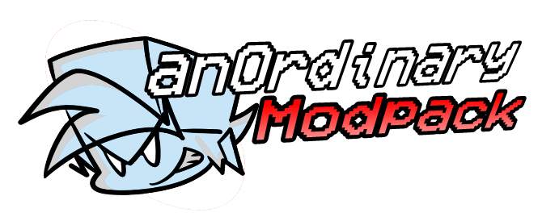

AOM (anOrdinaryModpack) is a recopilation of the golden Era of [Friday Night' Funkin](https://www.newgrounds.com/portal/view/770371) Mods totally Ported/Recreated in a modern Engine using [Codename Engine](https://codename-engine.com/).

# [Lastest Release](https://github.com/SantiYea/AOM-Revival/releases/latest)

> [!IMPORTANT]
> This project doesn't incite to replace all the Mods/Songs added to this Recopilation, we only do this as a Love Cart to the Community and provide a new Way to Replay these Mods/Songs and also because we love FNF aside of all Controversies that some Mods/Songs got.
>
> -. Zanxt

> [!CAUTION]
> This Modpack only works under most updated Builds (aka Nightly's Builds or Actions Builds) of Codename Engine, It's not gonna work in the latest PUBLIC Release, the Modpack itself will detect that and will close automatically.
>
> For download these Nightly's Builds, [CNE Page](https://codename-engine.com/) provides that scrolling a bit down.
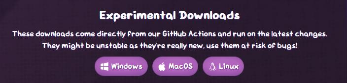

# [ Menus ]
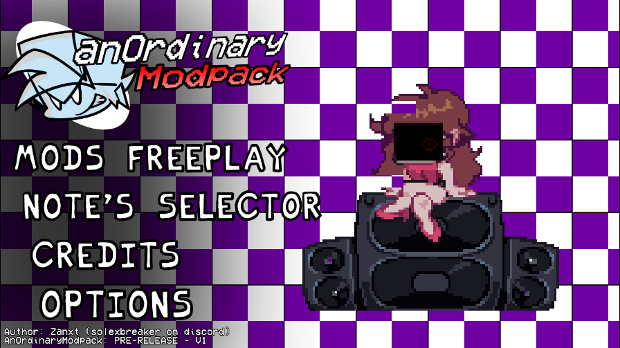
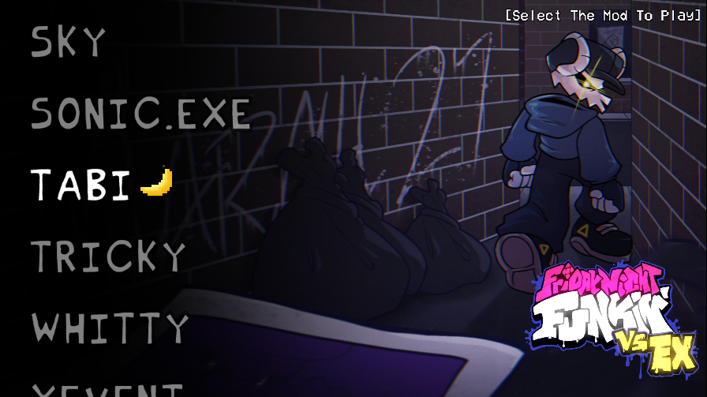
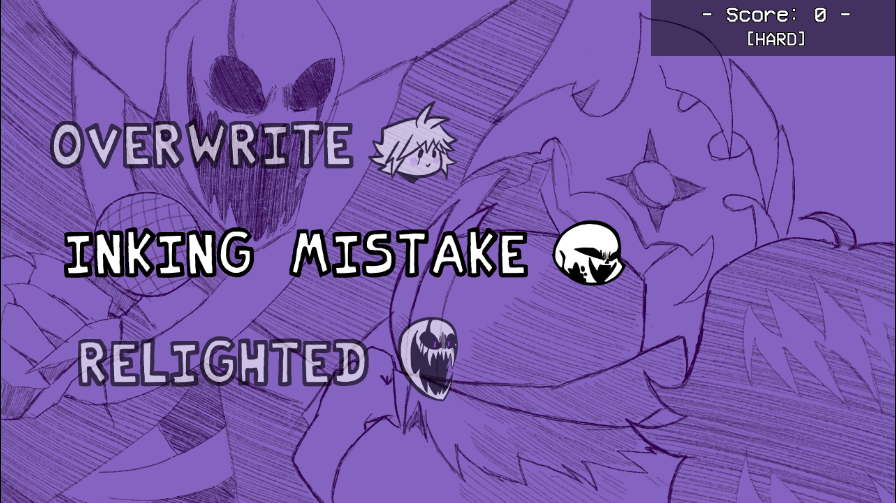
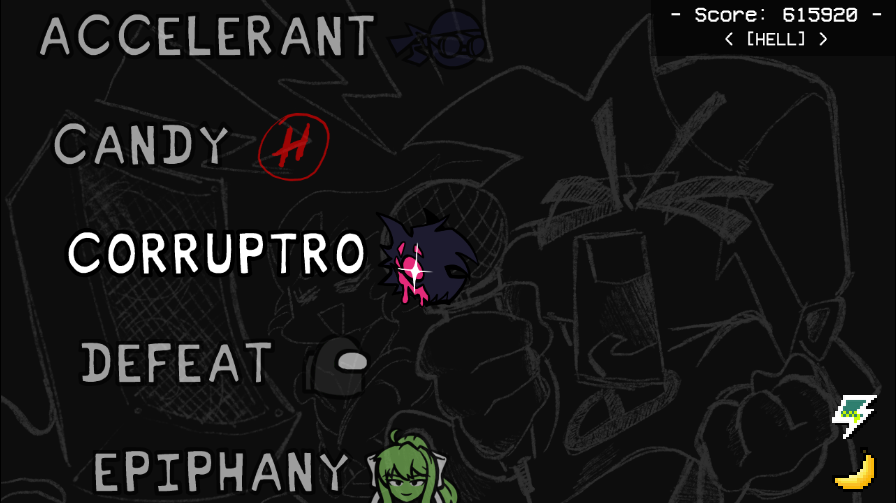

# [ Features ]
### - HUDS
Via Options of the Modpack, you can Turn on/off if you wanna use our Recreated Huds of some different Engines/Mods, like for Example:

- Kade Engine (Completely configurable)
- Psych Engine (Completely configurable)
- Forever Engine (Completely configurable)
- Sonic CD/3&K HUD
- Vanilla HUD (Funkin v2.7.1)
- VS Online
- Mic'dUp Engine HUD

For now, is not possible (Yet) to select personally the HUD you want.

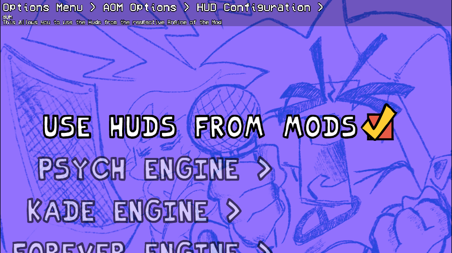

### - Note Skin Selector
To compensate the inability to select the multiples HUD we have, we decided to create this Fancy Note SKin Selector, it works for every Song playable.

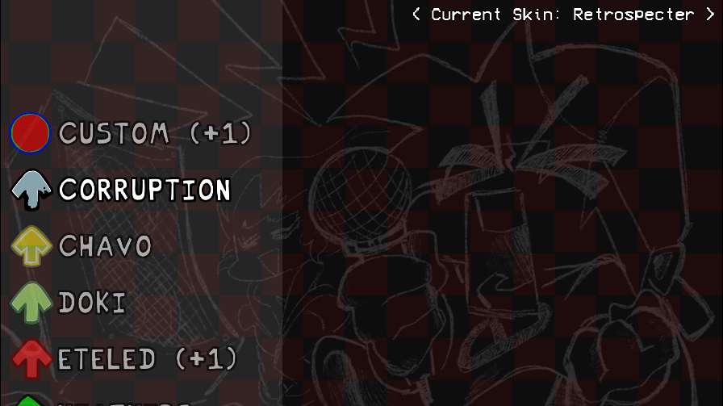

It also haves a fully editable RGB Notes for make more comfortable your Gameplay.

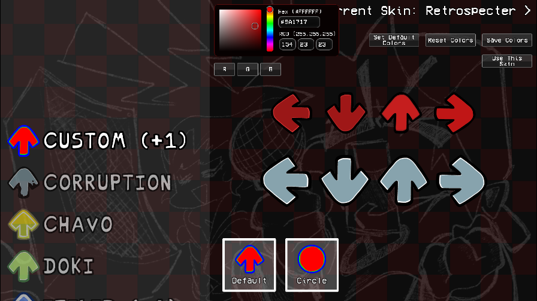

### - Reactive RPC Displayer
Not really a _huge_ feature but visually great for those Stalkers who likes to watch what people are doing.

Depending the Mod/Song you play, your RPC will Display a cool AlbumArt.

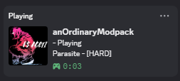
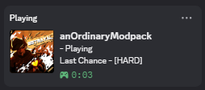

### - Mobile Support!
Thanks to [ArkoseLabs](https://github.com/ArkoseLabsOfficial), is totally possible to enjoy this Modpack under this [Codename Engine Mobile Port](https://github.com/ArkoseLabsOfficial/CodenameEngine-Mobile) (Unnoficial Port).

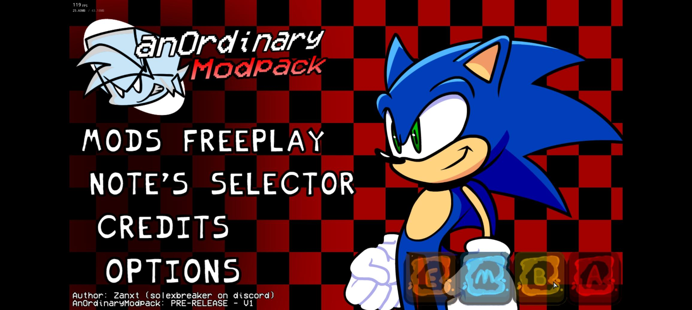
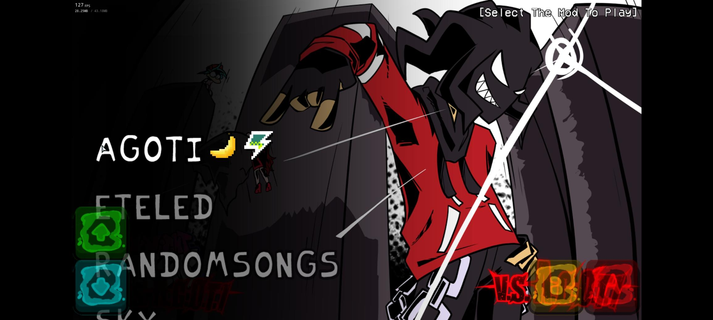
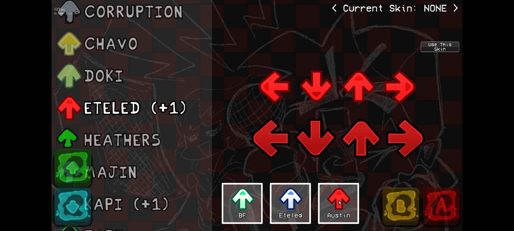
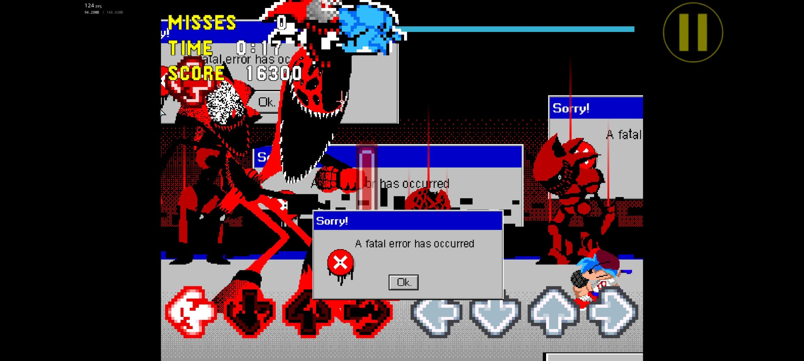

> [!NOTE]
> if you're the Director, Dev or Creator of ANY of these Mods and you don't want your Mod to be included here, you can contact me in Discord (solexbreaker) or Making a Issue in Issues Tab, just make sure when you try to contact me prove yourself that you're one of the Devs of your Mod.
>
> ABOUT CREDITS: All the credits are reflected in the "Mod Freeplay" with its respective original Page and Icon too, by clicking them it redirects you to their Pages, same goes for the "RandomSongs" Section when scrolling though the Songs.

.
.
.
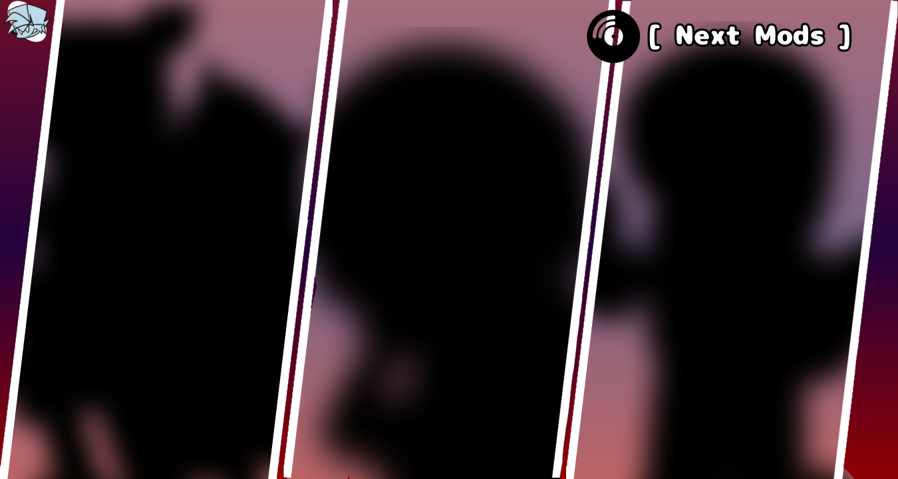
